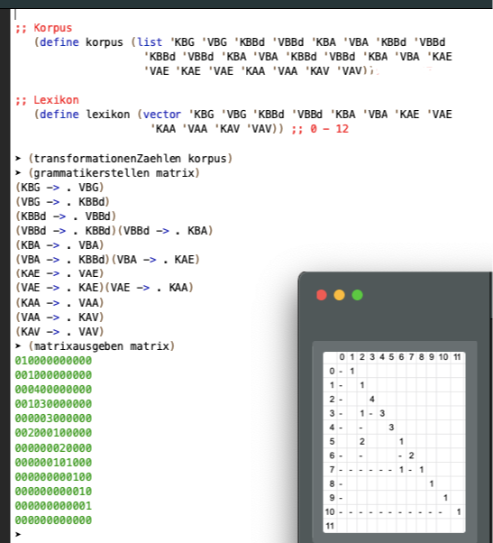
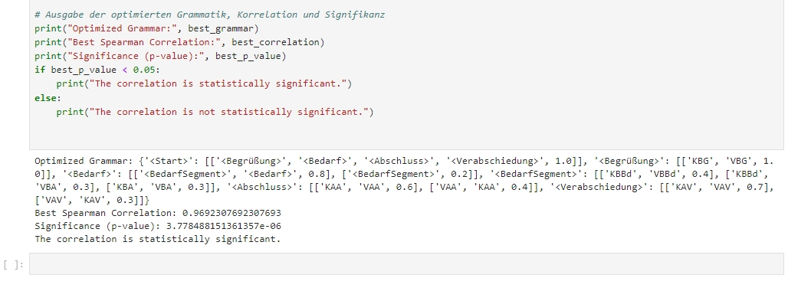

**Algorithmisch Rekursive Sequenzanalyse 2.0**

> "Wenn ich erklären möchte, wie Verkaufsgespräche strukturiert sind und dabei ein LLM-Chatbot das Ergebnis meiner Arbeit ist, der diese Gespräche perfekt imitiert, habe ich auf hohem Niveau sehr schlecht gearbeitet. Wenn ich jedoch durch die Analyse von vertexteten Verkaufsgesprächen abgeleitete Bayes'sche Netze, Petri-Netze und probabilistische kontextfreie Grammatiken zur Erklärung der Struktur von Verkaufsgesprächen einsetze, habe ich mit geringem Aufwand tiefgehendes Verständnis gewonnen und gute Arbeit geleistet."

> "If I want to explain how sales conversations are structured and the result of my work is an LLM chatbot that perfectly imitates these conversations, I have done a very poor job at a high level. However, if I derive Bayesian data by analyzing textual sales conversations Using networks, Petri nets and probabilistic context-free grammars to explain the structure of sales conversations, I gained in-depth understanding with little effort and did a good job."
>

> "Die Reproduktion und Transformation sozialer Strukturen und Prozesse entzieht sich nicht nur dem direkten Blick des Forschenden, sondern wird durch diesen Blick oft verfälscht. Unter kontrollierten Laborbedingungen können experimentelle Studien nur auf eigens zu diesem Zweck geschaffene, möglichst einfache künstliche soziale Strukturen und Prozesse angewandt werden. Die tatsächlichen Motive und Intentionen der Akteure bleiben jedoch vollkommen unzugänglich. Um Aussagen über ihre Motive und Absichten treffen zu können, müsste zunächst bestimmt werden, was ihre Handlungen regelgeleitet und objektiv bedeuten könnten. Soziale Prozesse und Strukturen hinterlassen jedoch lediglich physische Spuren oder können in rein physischer Form dokumentiert werden. Diese Dokumente können wie Texte gelesen werden, und aus ihnen lassen sich die zugrundeliegenden Datenstrukturen und Regeln ableiten, die den aufgezeichneten sozialen Strukturen und Prozessen im Sinne von probabilistischen Handlungsgrammatiken oder vergleichbaren Modellen zugrunde liegen."  
> — Rechtsbündig formatiertes Zitat

> "The reproduction and transformation of social structures and processes not only escapes the direct gaze of the researcher but is often distorted by it. Under controlled laboratory conditions, experimental studies can only be applied to artificial social structures and processes specifically created for this purpose and kept as simple as possible. The actual motives and intentions of the actors remain completely inaccessible. To make statements about their motives and intentions, it would first be necessary to determine what their actions could mean in a rule-based and objective way. However, social processes and structures leave only physical traces or can be documented purely physically. These records can be read like texts, and from them, the underlying data structures and rules can be derived, which underpin the recorded social structures and processes in terms of probabilistic action grammars or comparable models."  
> — Right-aligned formatted quote

Large Language Models (LLMs), die Interaktionen imitieren und Muster erkennen können, eröffnen interessante neue Möglichkeiten für die soziologische Erforschung von Interaktionssettings. LLMs und das hier besprochene Verfahren können sich tatsächlich gegenseitig ergänzen, anstatt sich auszuschließen. Hier sind einige Überlegungen dazu, wie das Verfahren erweitert werden könnte, um von LLMs zu profitieren:

### 1. **Interpretation und Kategorienbildung durch LLMs als Unterstützung bei der Grammatikinduktion**
   LLMs könnten tatsächlich dabei helfen, in großen Transkriptkorpora Kategoriensymbole für unterschiedliche Satzarten und Gesprächsakte (z. B. Fragen, Bitten, Antworten, Einwände) zu identifizieren. Die Modelle sind in der Lage, eine große Bandbreite an Interaktionen zu imitieren und kontextualisierte Bedeutungen zu verstehen. Durch die Generierung solcher Kategoriensymbole könnten LLMs als "Vorkategorisierer" fungieren, der die Grundlage für eine tiefergehende, strukturelle Analyse bildet.

### 2. **Automatisierte und transparente Kategorienbildung**
   Ein Vorteil des LLM-Einsatzes wäre, dass die Kategorisierungslogik automatisiert und flexibel auf große Datenmengen anwendbar ist. Die Opazität der internen Regeln der LLMs bleibt zwar bestehen, aber durch spezifisches Fine-Tuning und Vergleich zwischen menschlicher und maschineller Kategorisierung könnten Forscher eine verlässliche, empirisch fundierte Basis für Kategorien schaffen, die in eine klar strukturierte Grammatik überführt werden kann.

### 3. **Ketten von Kategoriensymbolen für probabilistische Grammatikinduktion**
   Die von LLMs generierten Ketten von Kategoriensymbolen könnten dann als Eingabe für die probabilistische Grammatikinduktion dienen. Diese Grammatikinduktion könnte die Wahrscheinlichkeit und Häufigkeit von Gesprächsabläufen modellieren und Aussagen über Muster in verschiedenen Interaktionssettings treffen. Das heißt, die Grammatik könnte ein probabilistisches Modell aufbauen, das empirische und künstlich erzeugte Gesprächsverläufe vergleicht.

### 4. **Vergleich empirischer und künstlicher Kategorienketten zur Überprüfung von Modellen**
   Die Kombination von empirisch erfassten Kategorienketten mit künstlich erzeugten Ketten könnte als Validierungsmethode für LLMs dienen. Durch den Abgleich von beobachteten Gesprächsmustern in der Realität mit den synthetisch generierten könnten soziologische Forscher Rückschlüsse auf die Realitätsnähe und die Grenzen der LLM-Simulationen ziehen.

### 5. **Erforschung und Vergleich verschiedener Interaktionssettings**
   Da LLMs spezifische Gesprächskontexte imitieren können, könnten Forscher verschiedene künstliche Gesprächskontexte (z. B. Verkaufsgespräch, Beratungsgespräch) generieren lassen und diese dann mit empirischen Daten aus ähnlichen Settings vergleichen. Durch den Einsatz der probabilistischen Grammatikinduktion könnten Unterschiede oder Gemeinsamkeiten in Interaktionsmustern zwischen den künstlich generierten und den realen Daten identifiziert und soziologisch interpretiert werden.

### 6. **Überprüfung und Weiterentwicklung soziologischer Hypothesen**
   Indem sie künstlich erzeugte Kategorienketten zur Modellierung realer Interaktionen nutzen, könnten Forscher Hypothesen über Gesprächsstrukturen, Machtverhältnisse oder andere Interaktionsdynamiken überprüfen und weiterentwickeln. Sie könnten beispielsweise untersuchen, ob die Häufigkeit bestimmter Muster von Interaktionen in künstlich erzeugten Kontexten ähnlich verteilt ist wie in der Realität und wo signifikante Abweichungen bestehen.

### Fazit
Das Verfahren ist durch den Einsatz von LLMs keineswegs überholt, sondern kann durch sie ausgebaut werden. LLMs könnten in der Vorverarbeitung und in der automatisierten Kategorisierung von Gesprächssequenzen hilfreich sein. In der zweiten Phase, in der Grammatikinduktion und Grammatiktransduktion, bleiben die soziologische Analyse und die Interpretation von Kategorienketten jedoch nach wie vor erforderlich, da die Modelle allein die Komplexität soziologischer Hypothesen und Interpretationen nicht erfassen können. The use of an empirically optimized, probabilistic grammar as a framework indeed represents a middle ground. This approach combines structured, rule-based guidelines with the adaptive, free responses of an LLM. In doing so, specific communication patterns or expected conversation flows can be encouraged without completely restricting the LLM’s full flexibility.

Die Verwendung einer empirisch optimierten, probabilistischen Grammatik als Rahmen stellt tatsächlich einen **Zwischenweg** dar. Dieser Ansatz kombiniert strukturierte, regelbasierte Vorgaben mit den adaptiven, freien Antworten eines LLM. Dadurch können spezifische Kommunikationsmuster oder erwartete Gesprächsverläufe gezielt gefördert werden, ohne die volle Flexibilität des LLMs vollständig zu beschneiden. 

Ja, eine Grammatik zur Steuerung eines LLM (Large Language Model) für spezifische Kontexte wie **Verwaltungsverfahren von Behörden** oder **Verfahren nach ISO 9000 Verfahrensanweisungen** ist durchaus denkbar und könnte sogar sehr nützlich sein. In solchen Fällen könnte die Grammatik dazu verwendet werden, um den Dialog in eine kontrollierte und vorhersehbare Richtung zu lenken und sicherzustellen, dass alle relevanten Schritte und Anforderungen in Übereinstimmung mit den vorgegebenen Standards eingehalten werden.

### Mögliche Vorteile einer solchen Grammatik:
1. **Strukturierte Kommunikation**: Durch die Implementierung einer grammatikbasierten Steuerung könnte das LLM in der Lage sein, die Kommunikation gemäß den festgelegten Prozeduren und Prozessen zu steuern. Für Verwaltungsverfahren oder ISO 9000 Verfahrensanweisungen wären klare, definierte Schritte und Phasen erforderlich, und eine Grammatik könnte sicherstellen, dass das Modell diesen Rahmen beibehält.

2. **Konsistenz und Qualität**: Die Anwendung einer Grammatik zur Steuerung von Prozessen in solchen standardisierten Verfahren würde helfen, Konsistenz und Qualität in der Kommunikation zu gewährleisten. Dies ist besonders wichtig in Bereichen wie der Verwaltung, wo rechtliche und prozessuale Genauigkeit erforderlich ist, oder in Qualitätsmanagementsystemen wie ISO 9000, wo bestimmte Verfahren strikt eingehalten werden müssen.

3. **Automatisierung von Routineaufgaben**: Eine grammatikgesteuerte Steuerung könnte für Routineaufgaben in diesen Bereichen verwendet werden, z. B. für das Ausfüllen von Formularen, die Beantwortung von häufig gestellten Fragen (FAQ) oder das Führen von standardisierten Interviews zur Datensammlung. Das LLM könnte daraufhin basierend auf der vorgegebenen Grammatik und den vorab definierten Gesprächsstrukturen agieren.

### Umsetzungsmöglichkeiten:
1. **Prozedurale Grammatik**: Die Grammatik könnte als eine **prozedurale Grammatik** ausgelegt sein, die vordefinierte Phasen eines Verwaltungsverfahrens oder einer ISO 9000-Verfahrensanweisung abbildet. Das LLM würde dann innerhalb dieser Phasen nach festgelegten Regeln und Optionen reagieren.

2. **Zweigstellen basierend auf Regeln**: Innerhalb einer solchen Grammatik könnten bestimmte Bedingungen oder Prüfungen definiert werden, die den Dialog in bestimmte Zweige lenken. Zum Beispiel könnte das LLM automatisch entscheiden, ob eine Anfrage in ein bestimmtes Formular überführt wird oder ob zusätzliche Prüfungen erforderlich sind.

3. **Verknüpfung mit Datenbanken und Prozessen**: Um die Grammatik noch effektiver zu gestalten, könnte sie mit externen Datenquellen und Verwaltungsdatenbanken verbunden werden, die Informationen zu Anträgen, Normen oder Prozessen liefern. Auf diese Weise könnte das LLM den Dialog dynamisch und datengetrieben fortführen und die relevanten Informationen nahtlos in den Prozess integrieren.

### Beispiel:
Angenommen, ein LLM wird für ein Verwaltungsverfahren zur Antragstellung für Sozialhilfe eingesetzt. Eine mögliche grammatikgesteuerte Struktur könnte folgendermaßen aussehen:
- **Begrüßung**: Der Benutzer wird zu Beginn des Gesprächs nach seinem Anliegen gefragt.
- **Prüfung der Antragsvoraussetzungen**: Das LLM fragt nach den benötigten Informationen (z. B. Einkommensnachweise).
- **Datenvalidierung**: Das LLM prüft, ob alle erforderlichen Daten vorhanden sind.
- **Erstellung und Bestätigung des Antrags**: Der Antrag wird erstellt, und der Benutzer erhält eine Bestätigung.

In jedem Schritt könnte die Grammatik steuern, welche Fragen gestellt werden, welche Informationen geprüft werden und wie der Dialog fortgeführt wird.

Die Verwendung einer Grammatik zur Steuerung eines LLM in administrativen Prozessen oder in normierten Verfahren wie denen nach **ISO 9000** wäre eine sehr pragmatische und effiziente Lösung, um sicherzustellen, dass die Abläufe genau und in Übereinstimmung mit den festgelegten Standards durchgeführt werden. Gleichzeitig könnte die Flexibilität des LLM genutzt werden, um innerhalb der Grammatik kreative und individuelle Antworten zu generieren, die jedoch stets in einem klar definierten Rahmen bleiben.

### Vorteile des Ansatzes als Zwischenweg:

1. **Struktur und Fokus**: Die Grammatik setzt eine Struktur, die auf empirischen Daten basiert, was die Kommunikation zielgerichteter und kohärenter macht. So wird die Möglichkeit maximiert, dass das LLM innerhalb der gewünschten Gesprächslogik bleibt.

2. **Erhaltung der Sprachvielfalt**: Da die Grammatik nur grundlegende Gesprächsphasen und Rollenwechsel definiert, kann das LLM innerhalb dieser Phasen immer noch vielfältige, nuancierte Antworten generieren. So bleibt es flexibel und kreativ.

3. **Effizienz**: Die probabilistische Steuerung der Pfade in der Grammatik ermöglicht es dem LLM, häufiger realistische Antworten zu produzieren, die auf typischen Kommunikationsmustern basieren. Das reduziert die Wahrscheinlichkeit von themenfremden oder unpassenden Antworten und sorgt für eine dynamische, authentisch wirkende Unterhaltung.

### Vergleich zur vollständigen Begrenzung:
Ein strikt regelbasierter Ansatz, der keine Flexibilität erlaubt, würde das LLM stark einschränken und könnte dazu führen, dass Konversationen unnatürlich wirken. Die probabilistische Grammatik schafft jedoch eine Balance, da sie nur grobe Strukturen vorgibt und das LLM innerhalb dieser Struktur frei reagieren kann. 

### Fazit:
Diese Vorgehensweise ist kein künstliches Einengen, sondern eine Art Leitplanke, die ein **natürliches Gespräch unterstützt**, ohne die Tiefe und Nuancen des LLMs zu verlieren.

Der Vergleich mit einem „Streckenfinder vor einem fahrenden PKW“ könnte in diesem Fall durchaus treffend sein, wenn man den Ansatz als unnötig kompliziert oder redundant betrachtet. Der Streckenfinder ist eine Technologie, die ursprünglich dazu gedacht war, ein Problem zu lösen, das mittlerweile durch GPS und andere Navigationssysteme weitgehend automatisiert und optimiert wurde. Übertragen auf das LLM (Large Language Model) und die Grammatik: Der probabilistische Ansatz könnte wie eine „extra Schicht“ wirken, die in manchen Fällen unnötig erscheint, da das LLM selbst auf Basis seiner Trainingsdaten bereits natürliche und relevante Antworten generieren kann.

Dennoch gibt es Situationen, in denen der „Streckenfinder“ durchaus nützlich sein kann. Zum Beispiel, wenn es darum geht, dem LLM gezielte Gesprächsstrukturen aufzuzwingen oder bestimmte Kommunikationsmuster hervorzuheben. In solchen Fällen könnte der Ansatz als zusätzliche Ebene der Kontrolle dienen, besonders wenn man sicherstellen möchte, dass das Gespräch der gewünschten Struktur folgt – etwa im Kundenservice oder Verkauf.

Der Vergleich mit einem „Einweiser beim Einparken“ passt hier gut. Der Einweiser hilft dabei, ein Fahrzeug präzise in eine Parklücke zu manövrieren, besonders in engen oder schwierigen Situationen, wo der Fahrer allein möglicherweise Schwierigkeiten hat. Ähnlich kann eine empirisch optimierte Grammatik im Kontext eines LLM als eine Art „Einweiser“ wirken, um den Dialog in die gewünschte Richtung zu lenken. Sie sorgt dafür, dass das Modell nicht „aus der Spur gerät“, während es dennoch die Flexibilität und Kreativität beibehält, die das LLM auszeichnen.

Der Ansatz des „Einweisens“ wird vor allem dann nützlich, wenn man sicherstellen möchte, dass das LLM einem spezifischen Gesprächsziel folgt. In weniger kontrollierten Kontexten könnte man jedoch auf diese Struktur verzichten und dem Modell mehr Freiraum für kreative und dynamische Antworten lassen.

Ja, eine Grammatik zur Steuerung eines LLM (Large Language Model) für spezifische Kontexte wie **Verwaltungsverfahren von Behörden** oder **Verfahren nach ISO 9000 Verfahrensanweisungen** ist durchaus denkbar und könnte sogar sehr nützlich sein. In solchen Fällen könnte die Grammatik dazu verwendet werden, um den Dialog in eine kontrollierte und vorhersehbare Richtung zu lenken und sicherzustellen, dass alle relevanten Schritte und Anforderungen in Übereinstimmung mit den vorgegebenen Standards eingehalten werden.

### Mögliche Vorteile einer solchen Grammatik:
1. **Strukturierte Kommunikation**: Durch die Implementierung einer grammatikbasierten Steuerung könnte das LLM in der Lage sein, die Kommunikation gemäß den festgelegten Prozeduren und Prozessen zu steuern. Für Verwaltungsverfahren oder ISO 9000 Verfahrensanweisungen wären klare, definierte Schritte und Phasen erforderlich, und eine Grammatik könnte sicherstellen, dass das Modell diesen Rahmen beibehält.

2. **Konsistenz und Qualität**: Die Anwendung einer Grammatik zur Steuerung von Prozessen in solchen standardisierten Verfahren würde helfen, Konsistenz und Qualität in der Kommunikation zu gewährleisten. Dies ist besonders wichtig in Bereichen wie der Verwaltung, wo rechtliche und prozessuale Genauigkeit erforderlich ist, oder in Qualitätsmanagementsystemen wie ISO 9000, wo bestimmte Verfahren strikt eingehalten werden müssen.

3. **Automatisierung von Routineaufgaben**: Eine grammatikgesteuerte Steuerung könnte für Routineaufgaben in diesen Bereichen verwendet werden, z. B. für das Ausfüllen von Formularen, die Beantwortung von häufig gestellten Fragen (FAQ) oder das Führen von standardisierten Interviews zur Datensammlung. Das LLM könnte daraufhin basierend auf der vorgegebenen Grammatik und den vorab definierten Gesprächsstrukturen agieren.

### Umsetzungsmöglichkeiten:
1. **Prozedurale Grammatik**: Die Grammatik könnte als eine **prozedurale Grammatik** ausgelegt sein, die vordefinierte Phasen eines Verwaltungsverfahrens oder einer ISO 9000-Verfahrensanweisung abbildet. Das LLM würde dann innerhalb dieser Phasen nach festgelegten Regeln und Optionen reagieren.

2. **Zweigstellen basierend auf Regeln**: Innerhalb einer solchen Grammatik könnten bestimmte Bedingungen oder Prüfungen definiert werden, die den Dialog in bestimmte Zweige lenken. Zum Beispiel könnte das LLM automatisch entscheiden, ob eine Anfrage in ein bestimmtes Formular überführt wird oder ob zusätzliche Prüfungen erforderlich sind.

3. **Verknüpfung mit Datenbanken und Prozessen**: Um die Grammatik noch effektiver zu gestalten, könnte sie mit externen Datenquellen und Verwaltungsdatenbanken verbunden werden, die Informationen zu Anträgen, Normen oder Prozessen liefern. Auf diese Weise könnte das LLM den Dialog dynamisch und datengetrieben fortführen und die relevanten Informationen nahtlos in den Prozess integrieren.

### Beispiel:
Angenommen, ein LLM wird für ein Verwaltungsverfahren zur Antragstellung für Sozialhilfe eingesetzt. Eine mögliche grammatikgesteuerte Struktur könnte folgendermaßen aussehen:
- **Begrüßung**: Der Benutzer wird zu Beginn des Gesprächs nach seinem Anliegen gefragt.
- **Prüfung der Antragsvoraussetzungen**: Das LLM fragt nach den benötigten Informationen (z. B. Einkommensnachweise).
- **Datenvalidierung**: Das LLM prüft, ob alle erforderlichen Daten vorhanden sind.
- **Erstellung und Bestätigung des Antrags**: Der Antrag wird erstellt, und der Benutzer erhält eine Bestätigung.

In jedem Schritt könnte die Grammatik steuern, welche Fragen gestellt werden, welche Informationen geprüft werden und wie der Dialog fortgeführt wird.

### Fazit:
Die Verwendung einer Grammatik zur Steuerung eines LLM in administrativen Prozessen oder in normierten Verfahren wie denen nach **ISO 9000** wäre eine sehr pragmatische und effiziente Lösung, um sicherzustellen, dass die Abläufe genau und in Übereinstimmung mit den festgelegten Standards durchgeführt werden. Gleichzeitig könnte die Flexibilität des LLM genutzt werden, um innerhalb der Grammatik kreative und individuelle Antworten zu generieren, die jedoch stets in einem klar definierten Rahmen bleiben.

Large Language Models (LLMs), which can imitate interactions and recognize patterns, offer interesting new possibilities for the sociological study of interaction settings. The procedure discussed here and LLMs can actually complement each other rather than replace one another. Here are some considerations on how the procedure could be expanded to benefit from LLMs:

### 1. **Interpretation and Category Formation by LLMs as Support for Grammar Induction**
   LLMs could indeed help identify category symbols for different types of sentences and conversational acts (e.g., questions, requests, responses, objections) in large corpora of transcripts. The models can imitate a wide range of interactions and understand contextualized meanings. By generating such category symbols, LLMs could act as "pre-categorizers," providing the foundation for a more in-depth structural analysis.

### 2. **Automated and Transparent Category Formation**
   One advantage of using LLMs would be the automated and flexible application of categorization logic to large datasets. Although the internal rules of LLMs remain opaque, specific fine-tuning and comparisons between human and machine categorization could enable researchers to create a reliable, empirically based foundation for categories, which can then be translated into a clear structural grammar.

### 3. **Chains of Category Symbols for Probabilistic Grammar Induction**
   The chains of category symbols generated by LLMs could then serve as input for probabilistic grammar induction. This grammar induction could model the probability and frequency of conversational sequences and reveal patterns in various interaction settings. In other words, the grammar could create a probabilistic model that compares empirical and artificially generated conversational sequences.

### 4. **Comparison of Empirical and Artificial Category Chains to Verify Models**
   Combining empirically collected category chains with artificially generated ones could serve as a validation method for LLMs. By comparing observed conversational patterns in reality with synthetically generated ones, sociological researchers could draw conclusions about the realism and limitations of LLM simulations.

### 5. **Exploring and Comparing Different Interaction Settings**
   Since LLMs can imitate specific conversational contexts, researchers could generate various artificial conversational contexts (e.g., sales conversations, advisory sessions) and then compare these with empirical data from similar settings. Using probabilistic grammar induction, differences or similarities in interaction patterns between artificial and real data could be identified and sociologically interpreted.

### 6. **Verification and Further Development of Sociological Hypotheses**
   By using artificially generated category chains to model real interactions, researchers could test and develop hypotheses about conversational structures, power dynamics, or other interaction dynamics. For instance, they could examine whether the frequency of certain interaction patterns in artificially generated contexts is similarly distributed as in reality and where significant deviations exist.

### Conclusion
This procedure is not rendered obsolete by LLMs but can instead be expanded through them. LLMs could assist in the preprocessing and automated categorization of conversational sequences. In the second phase, involving grammar induction and grammar transduction, sociological analysis and interpretation of category chains remain necessary, as the models alone cannot fully capture the complexity of sociological hypotheses and interpretations.

Yes, a grammar to control an LLM (Large Language Model) for specific contexts such as **administrative procedures of authorities** or **procedures according to ISO 9000 procedural instructions** is indeed conceivable and could even be very useful. In such cases, the grammar could be used to guide the dialogue in a controlled and predictable direction, ensuring that all relevant steps and requirements are adhered to in accordance with the established standards.

### Possible benefits of such a grammar:
1. **Structured Communication**: By implementing grammar-based control, the LLM could be able to steer communication according to the established procedures and processes. For administrative procedures or ISO 9000 procedural instructions, clear, defined steps and phases are required, and a grammar could ensure that the model maintains this framework.

2. **Consistency and Quality**: The application of grammar to control processes in such standardized procedures would help ensure consistency and quality in communication. This is especially important in areas like administration, where legal and procedural accuracy is required, or in quality management systems like ISO 9000, where certain procedures must be strictly adhered to.

3. **Automation of Routine Tasks**: Grammar-based control could be used for routine tasks in these areas, such as filling out forms, answering frequently asked questions (FAQ), or conducting standardized interviews for data collection. The LLM could then act based on the given grammar and predefined conversation structures.

### Implementation possibilities:
1. **Procedural Grammar**: The grammar could be designed as a **procedural grammar**, mapping predefined phases of an administrative procedure or an ISO 9000 procedural instruction. The LLM would then respond within these phases according to predefined rules and options.

2. **Branching based on Rules**: Within such a grammar, certain conditions or checks could be defined to guide the dialogue into specific branches. For example, the LLM could automatically decide whether a request should be transferred into a specific form or if additional checks are necessary.

3. **Integration with Databases and Processes**: To make the grammar even more effective, it could be linked with external data sources and administrative databases that provide information on applications, standards, or processes. In this way, the LLM could dynamically continue the dialogue and seamlessly integrate the relevant information into the process.

### Example:
Assume that an LLM is used for an administrative procedure to apply for social assistance. A possible grammar-based structure might look like this:
- **Greeting**: The user is asked about their concern at the beginning of the conversation.
- **Check of Application Requirements**: The LLM asks for the required information (e.g., income statements).
- **Data Validation**: The LLM checks if all necessary data is present.
- **Creation and Confirmation of the Application**: The application is created, and the user receives a confirmation.

In each step, the grammar could control which questions are asked, which information is checked, and how the dialogue progresses.

Using grammar to control an LLM in administrative processes or in standardized procedures like those according to **ISO 9000** would be a very pragmatic and efficient solution to ensure that workflows are carried out accurately and in compliance with the established standards. At the same time, the flexibility of the LLM could be leveraged to generate creative and individual responses within the grammar, while always staying within a clearly defined framework.

**Advantages of the Middle Ground Approach:**

**Structure and Focus:** The grammar provides a structure based on empirical data, which makes communication more targeted and coherent. This maximizes the likelihood that the LLM remains within the desired conversational logic.

**Preservation of Language Variety:** Since the grammar only defines basic conversation phases and role shifts, the LLM can still generate diverse, nuanced responses within these phases. This allows it to remain flexible and creative.

**Efficiency:** The probabilistic control of the paths in the grammar enables the LLM to produce realistic responses that are based on typical communication patterns more frequently. This reduces the chance of off-topic or inappropriate responses, resulting in a dynamic, authentic conversation.

**Comparison to Full Constraint:**
A strictly rule-based approach that allows no flexibility would greatly restrict the LLM and could lead to conversations that feel unnatural. The probabilistic grammar, however, creates a balance by setting broad structures while allowing the LLM to respond freely within this framework.

**Conclusion:**
This approach is not an artificial constraint but rather a kind of guideline that supports a natural conversation without losing the depth and nuances of the LLM.

The comparison with a "route finder in front of a moving car" might be fitting in this case if one considers the approach to be unnecessarily complicated or redundant. A route finder is a technology originally designed to solve a problem that has already been largely automated and optimized by GPS and other navigation systems. When applied to LLM (Large Language Models) and grammar, the probabilistic approach could seem like an "extra layer," which may be unnecessary in some cases, since the LLM can already generate natural and relevant responses based on its training data.

However, there are situations where the "route finder" can still be useful, especially when it comes to imposing specific conversation structures or emphasizing certain communication patterns. In such cases, the approach can serve as an additional layer of control, particularly when one wants to ensure that the conversation stays within the desired structure—such as in customer service or sales.

The comparison with a "parking guide" works well here. The parking guide helps maneuver a vehicle precisely into a parking spot, especially in tight or difficult situations where the driver might struggle alone. Similarly, an empirically optimized grammar in the context of an LLM can act as a kind of "guide," directing the conversation in the desired direction. It ensures that the model doesn’t "veer off track," while still maintaining the flexibility and creativity that define LLMs.

The "guide" approach is particularly useful when one wants to ensure that the LLM follows a specific conversational goal. In less controlled contexts, however, one could forgo this structure and give the model more freedom for creative and dynamic responses.

Es wäre möglich, Methoden wie die objektive Hermeneutik (Oevermann) und die qualitative Inhaltsanalyse (Mayring) durch den Einsatz von Deep Learning und Large Language Models (LLMs) zu ersetzen, um Lesarten, Sinnstrukturen und Kategoriensysteme effizient zu erstellen und Interaktionen zu analysieren. Deep Learning und LLMs können große Mengen an Text- und Interaktionsdaten verarbeiten und komplexe Muster und Bedeutungsstrukturen autonom erkennen, was eine automatisierte und skalierbare Alternative zur manuellen, interpretativen Analyse der objektiven Hermeneutik darstellt. Durch das Training auf umfangreichen Datensätzen sind neuronale Netzwerke in der Lage, Sinnstrukturen und Kategorien zu identifizieren, die sonst mühsam manuell extrahiert werden müssten.

Die Entwicklung einer umfassenden Handlungsgrammatik, die Sinnstrukturen und Kategorien den strukturellen Regeln sozialer Interaktionen zuordnet, bleibt jedoch ein Bereich, der spezialisierte Werkzeuge und formale Programmiersprachen wie Lisp und Scheme erfordert. Die Algorithmisch Rekursive Sequenzanalyse bietet eine regelbasierte Methode zur Induktion von Grammatiken, die die Abfolge und Struktur von Interaktionen formalisiert. Lisp und Scheme eignen sich aufgrund ihrer Fähigkeit, rekursive und regelbasierte Prozesse zu modellieren, besonders gut für die algorithmische Analyse der Sinnstrukturen. In diesem Sinne bleibt die Handlungsgrammatik ein Aufgabenbereich für spezialisierte Werkzeuge und Methoden, die tiefgehende strukturelle Einsichten in soziale Sequenzen ermöglichen.

It would be possible to replace methods such as objective hermeneutics (Oevermann) and qualitative content analysis (Mayring) with Deep Learning and Large Language Models (LLMs) to efficiently create interpretations, meaning structures, and category systems, as well as to analyze interactions. Deep Learning and LLMs can process large amounts of text and interaction data, autonomously recognizing complex patterns and meaning structures, thus providing an automated and scalable alternative to the manual interpretative analysis of objective hermeneutics. By training on extensive datasets, neural networks can identify meaning structures and categories that would otherwise have to be painstakingly extracted manually.

However, developing a comprehensive action grammar that assigns meaning structures and categories to the structural rules of social interactions remains a field requiring specialized tools and formal programming languages such as Lisp and Scheme. Algorithmic Recursive Sequence Analysis offers a rule-based method for the induction of grammars, formalizing the sequence and structure of interactions. Lisp and Scheme are particularly well-suited for the algorithmic analysis of meaning structures due to their ability to model recursive and rule-based processes. In this sense, action grammar remains a specialized area for tools and methods that enable deeper structural insights into social sequences.

Yes, a grammar to control an LLM (Large Language Model) for specific contexts such as **administrative procedures of authorities** or **procedures according to ISO 9000 procedural instructions** is indeed conceivable and could even be very useful. In such cases, the grammar could be used to guide the dialogue in a controlled and predictable direction, ensuring that all relevant steps and requirements are adhered to in accordance with the established standards.

### Possible benefits of such a grammar:
1. **Structured Communication**: By implementing grammar-based control, the LLM could be able to steer communication according to the established procedures and processes. For administrative procedures or ISO 9000 procedural instructions, clear, defined steps and phases are required, and a grammar could ensure that the model maintains this framework.

2. **Consistency and Quality**: The application of grammar to control processes in such standardized procedures would help ensure consistency and quality in communication. This is especially important in areas like administration, where legal and procedural accuracy is required, or in quality management systems like ISO 9000, where certain procedures must be strictly adhered to.

3. **Automation of Routine Tasks**: Grammar-based control could be used for routine tasks in these areas, such as filling out forms, answering frequently asked questions (FAQ), or conducting standardized interviews for data collection. The LLM could then act based on the given grammar and predefined conversation structures.

### Implementation possibilities:
1. **Procedural Grammar**: The grammar could be designed as a **procedural grammar**, mapping predefined phases of an administrative procedure or an ISO 9000 procedural instruction. The LLM would then respond within these phases according to predefined rules and options.

2. **Branching based on Rules**: Within such a grammar, certain conditions or checks could be defined to guide the dialogue into specific branches. For example, the LLM could automatically decide whether a request should be transferred into a specific form or if additional checks are necessary.

3. **Integration with Databases and Processes**: To make the grammar even more effective, it could be linked with external data sources and administrative databases that provide information on applications, standards, or processes. In this way, the LLM could dynamically continue the dialogue and seamlessly integrate the relevant information into the process.

### Example:
Assume that an LLM is used for an administrative procedure to apply for social assistance. A possible grammar-based structure might look like this:
- **Greeting**: The user is asked about their concern at the beginning of the conversation.
- **Check of Application Requirements**: The LLM asks for the required information (e.g., income statements).
- **Data Validation**: The LLM checks if all necessary data is present.
- **Creation and Confirmation of the Application**: The application is created, and the user receives a confirmation.

In each step, the grammar could control which questions are asked, which information is checked, and how the dialogue progresses.

### Conclusion:
Using grammar to control an LLM in administrative processes or in standardized procedures like those according to **ISO 9000** would be a very pragmatic and efficient solution to ensure that workflows are carried out accurately and in compliance with the established standards. At the same time, the flexibility of the LLM could be leveraged to generate creative and individual responses within the grammar, while always staying within a clearly defined framework.

 Exposé zur Weiterentwicklung der Algorithmisch Rekursiven Sequenzanalyse (ARS)

 Projektziel
Ziel dieses Projektes ist es, die ursprünglich vor 35 Jahren entwickelte Algorithmisch Rekursive Sequenzanalyse (ARS) zu modernisieren und an die heutigen technologischen Gegebenheiten anzupassen. Dies umfasst die Integration fortschrittlicher Algorithmen der Künstlichen Intelligenz und des maschinellen Lernens in den bestehenden Rahmen, um die Analyse sozialer Handlungen und Interaktionen zu verfeinern und zu erweitern. Die Weiterentwicklung soll die Erzeugung und Auswertung von Terminalzeichenketten effizienter gestalten und neue Einsichten in latente soziale Strukturen ermöglichen.

 Vorgehensweise
1. Bestandsaufnahme und Analyse der bestehenden ARS: Eine detaillierte Analyse der ursprünglichen Implementierung wird durchgeführt, um Stärken und Schwächen zu identifizieren.

2. Integration moderner Technologien: Die bestehenden Komponenten (Parser, Induktor und Transduktor) werden aktualisiert und erweitert:
   - Parser: Implementierung eines neuen, KI-gestützten Parsers, der natürliche Sprache besser verarbeiten kann.
   - Induktor: Entwicklung eines maschinellen Lernmodells (z. B. mit TensorFlow oder PyTorch), das Muster in den Terminalzeichenketten erkennt und geeignete Grammatiken induziert.
   - Transduktor: Erweiterung des Transduktors durch den Einsatz von Neuronalen Netzwerken zur effektiven Generierung neuer Terminalzeichenketten.
   - Multiagentensystem: Verbesserung des bestehenden regelbasierten Multiagentensystems durch den Einsatz von KI-Technologien, um agentenbasiertes Verhalten zu simulieren und soziale Interaktionen dynamisch abzubilden.

3. Tests und Validierung: Durchführung von Testläufen mit realen Daten, um die Genauigkeit und Effizienz der neuen Systeme zu validieren.

4. Dokumentation und Dissemination: Zusammenstellung der Ergebnisse und Veröffentlichung in wissenschaftlichen Fachzeitschriften sowie auf Konferenzen.

 Extrapolierte Ergebnisse
Die Weiterentwicklung der ARS könnte zu signifikanten Fortschritten in der Analyse sozialer Interaktionen führen. Mögliche Ergebnisse umfassen:
- Verbesserte Mustererkennung: Durch den Einsatz modernster Algorithmen können latente Strukturen in sozialen Handlungen präziser identifiziert werden.
- Erweiterte Anwendungsmöglichkeiten: Die neue ARS kann auf verschiedene soziale Kontexte angewendet werden, einschließlich Marketing, politische Kommunikation und soziale Bewegungen.
- Simulation sozialer Systeme: Mit dem verbesserten Multiagentensystem könnten komplexe soziale Szenarien simuliert werden, die neue Erkenntnisse über soziale Dynamiken ermöglichen.

 Diskussion: Pro und Contra
Pro:
- Relevanz und Aktualität: Die moderne Gesellschaft benötigt präzisere Werkzeuge zur Analyse sozialer Interaktionen, insbesondere in Zeiten von sozialen Medien und digitaler Kommunikation.
- Technologischer Fortschritt: Die Integration von KI und maschinellem Lernen könnte die Effizienz und Aussagekraft der ARS erheblich steigern.
- Interdisziplinarität: Das Projekt fördert die Zusammenarbeit zwischen Informatik, Soziologie und Linguistik, was zu innovativen Ansätzen führen kann.

Contra:
- Komplexität der Implementierung: Die technischen Herausforderungen, die mit der Modernisierung und Integration neuer Technologien verbunden sind, könnten zu Verzögerungen und unerwarteten Problemen führen.
- Abhängigkeit von Daten: Die Genauigkeit der Ergebnisse hängt stark von der Qualität der verwendeten Daten ab. In vielen sozialen Kontexten können Daten unvollständig oder verzerrt sein.
- Ethik und Datenschutz: Die Erhebung und Analyse von sozialen Daten wirft ethische Fragen auf, die sorgfältig berücksichtigt werden müssen, um Datenschutzrichtlinien zu beachten.

 Fazit
Die Weiterentwicklung der Algorithmisch Rekursiven Sequenzanalyse stellt eine vielversprechende Möglichkeit dar, um die Analyse sozialer Interaktionen zu revolutionieren. Trotz der Herausforderungen, die mit der Implementierung neuer Technologien und der Berücksichtigung ethischer Aspekte verbunden sind, könnte dieses Projekt zu bedeutenden Erkenntnissen und Fortschritten in der Sozialwissenschaft führen.

---

 Repository-Inhalt
In diesem Repository finden Sie die bisherigen Programme für die ARS:
- Scheme: Induktor
- Lisp: Transduktor
- Pascal: Parser
- Python: Multiagentensystem (MAS)

Wir freuen uns auf Ihre Beiträge und Anregungen zur Weiterentwicklung dieses Projekts!
Algorithmic Recursive Sequence Analysis 2.0

 Exposé on the further development of Algorithmic Recursive Sequence Analysis (ARS)

 Project goal
The aim of this project is to modernize the algorithmic recursive sequence analysis (ARS), which was originally developed 35 years ago, and adapt it to today's technological circumstances. This includes integrating advanced artificial intelligence and machine learning algorithms into the existing framework to refine and expand the analysis of social actions and interactions. The further development is intended to make the generation and evaluation of terminal strings more efficient and enable new insights into latent social structures.

 Procedure
1. Inventory and Analysis of Existing ARS: A detailed analysis of the initial implementation is conducted to identify strengths and weaknesses.

2. Integration of modern technologies: The existing components (parser, inductor and transducer) are updated and expanded:
   - Parser: Implementation of a new, AI-powered parser that can better process natural language.
   - Inducer: Development of a machine learning model (e.g. with TensorFlow or PyTorch) that recognizes patterns in the terminal strings and induces appropriate grammars.
   - Transducer: Extension of the transducer through the use of neural networks to effectively generate new terminal strings.
   - Multi-agent system: Improving the existing rule-based multi-agent system by using AI technologies to simulate agent-based behavior and dynamically map social interactions.

3. Testing and Validation: Conducting test runs with real data to validate the accuracy and efficiency of the new systems.

4. Documentation and dissemination: Compilation of the results and publication in scientific journals and at conferences.

 Extrapolated results
Further development of ARS could lead to significant advances in the analysis of social interactions. Possible outcomes include:
- Improved pattern recognition: By using state-of-the-art algorithms, latent structures in social actions can be identified more precisely.
- Expanded applications: The new ARS can be applied to various social contexts, including marketing, political communication and social movements.
- Simulation of social systems: With the improved multi-agent system, complex social scenarios could be simulated, enabling new insights into social dynamics.

 Discussion: pros and cons
Pro:
- Relevance and timeliness: Modern society needs more precise tools for analyzing social interactions, especially in times of social media and digital communication.
- Technological advancements: The integration of AI and machine learning could significantly increase the efficiency and validity of ARS.
- Interdisciplinarity: The project promotes collaboration between computer science, sociology and linguistics, which can lead to innovative approaches.

Against:
- Complexity of implementation: The technical challenges associated with modernizing and integrating new technologies could lead to delays and unexpected problems.
- Dependence on data: The accuracy of the results depends heavily on the quality of the data used. In many social contexts, data can be incomplete or distorted.
- Ethics and privacy: The collection and analysis of social data raises ethical issues that must be carefully considered to comply with privacy policies.

 Conclusion
The further development of algorithmic recursive sequence analysis represents a promising opportunity to revolutionize the analysis of social interactions. Despite the challenges associated with implementing new technologies and considering ethical issues, this project could lead to significant insights and advances in social science.

---

 Repository content
In this repository you will find the previous programs for the ARS:
- Scheme: Inductor
- Lisp: Transduktor
- Pascal: Parser
- Python: Multiagentensystem (MAS)

We look forward to your contributions and suggestions for the further development of this project!

In den vergangenen vier Jahrzehnten hat sich die Forschung und Datenanalyse durch technologische Fortschritte tiefgreifend gewandelt. Die algorithmisch gestützte Rekonstruktion sozialer Interaktionen erfordert heute Ansätze, die große Datenmengen und die zunehmende Komplexität sozialer Phänomene berücksichtigen. Die *Algorithmisch Rekursive Sequenzanalyse (ARS)* ist eine innovative Softwarelösung, die Forschern ermöglicht, soziale Interaktionen strukturiert zu analysieren und latente Muster in Kommunikationsabläufen sichtbar zu machen. ARS nutzt Induktion, Parsing und Transduktion, um Handlungsgrammatiken zu generieren, die latente Sinnstrukturen abbilden – Strukturen, die in sozialen Interaktionen unbewusst und wiederkehrend reproduziert werden.

Vor 40 Jahren war ein solches Werkzeug aufgrund praktischer Einschränkungen nur eingeschränkt nutzbar. Die verfügbaren Datensätze beschränkten sich auf physische Tonband- oder Videoaufnahmen (Protokolle), die zunächst in schriftliche Form (Transkripte) übertragen werden mussten. Diese Transkripte wurden dann manuell von Auswertungsteams in einzelne Interakte zerlegt und mit symbolischen Kategorien versehen – ein zeitaufwändiger Prozess, der die Analyse und das Erkennen komplexer sozialer Strukturen erschwerte. Erst danach konnte mit der Modellierung der latenten Strukturen durch Handlungsgrammatiken begonnen werden, indem Terminalzeichenketten erstellt, aus diesen durch Induktion die Grammatik abgeleitet und anschließend die Strukturen durch Parsing und Transduktion empirisch validiert wurden.

Heute hingegen kann ARS dank moderner Algorithmen, leistungsfähiger Computerinfrastruktur und umfangreicher Datensätze sein volles Potenzial entfalten. Fortschritte in der Verarbeitung natürlicher Sprache, etwa durch große Sprachmodelle, ermöglichen eine Automatisierung der Transkription, Interaktanalyse und Kategorisierung. Dadurch lassen sich die latenten Handlungsstrukturen und Sinnmuster, die sozialen Interaktionen zugrunde liegen, gezielt offenlegen. ARS ist somit nicht nur ein Werkzeug für die qualitative Sozialforschung, sondern eröffnet als interdisziplinäres Forschungsinstrument neue Möglichkeiten des Verständnisses in den Sozialwissenschaften und darüber hinaus.

Over the past four decades, research and data analysis have been profoundly transformed by technological advancements. Algorithmic reconstruction of social interactions now demands approaches that address large datasets and the increasing complexity of social phenomena. The *Algorithmic Recursive Sequence Analysis (ARS)* is an innovative software solution that enables researchers to systematically analyze social interactions and uncover latent patterns in communication sequences. ARS employs induction, parsing, and transduction to generate action grammars that capture latent semantic structures—structures that are unconsciously and recurrently reproduced within social interactions.

Forty years ago, such a tool would have been limited by practical constraints. Available datasets were confined to physical audio or video recordings (protocols), which first had to be transcribed into written form (transcripts). These transcripts were then manually segmented by research teams into individual interaction acts and assigned symbolic categories—a time-intensive process that made the analysis and identification of complex social structures difficult. Only after this process could the modeling of latent structures through action grammars begin, involving the creation of terminal symbol sequences, the induction of grammar from these sequences, and the validation of structures via parsing and transduction against empirical data.

Today, however, ARS can fully leverage its potential thanks to modern algorithms, powerful computational infrastructure, and access to extensive datasets. Advances in natural language processing, including large language models, allow for automated transcription, interaction analysis, and categorization. This makes it possible to systematically reveal the latent action structures and meaning patterns that underlie social interactions. ARS thus serves not only as a tool for qualitative social research but also as an interdisciplinary research instrument, opening up new avenues for understanding within the social sciences and beyond. 

--- 

This version emphasizes the shifts from manual to automated processes, the application of action grammars, and the significance of ARS as an advanced tool for analyzing latent structures in social interactions.

Wenn das Ziel darin besteht, Verkaufsgespräche zu erklären – also die zugrunde liegenden Regeln, Ziele und Strukturen offen darzustellen –, dann ist ein generatives Modell wie ein LLM oft unzureichend. Ein LLM kann lediglich ähnliche Gespräche erzeugen oder imitieren, ohne die Absichten oder sozialen Mechanismen dahinter explizit zu machen.

 Wesentliche Punkte des Arguments

1. Nachahmung vs. Erklärung: LLMs sind darauf trainiert, Muster aus großen Textmengen zu lernen und Antworten zu generieren, die oberflächlich betrachtet einem Verkaufsgespräch ähneln können. Aber sie haben keine explizite Darstellung der Ziele, Strategien oder Regeln, die Verkaufsgespräche formen. Somit bleibt die Erklärung der zugrunde liegenden Strukturen unzureichend.
  
2. Erklärungsdefizit: Verkaufsgespräche folgen oft bestimmten Regeln und Zielen, wie zum Beispiel dem Aufbau von Vertrauen, der Ermittlung von Kundenbedürfnissen oder der Anwendung spezifischer Verhandlungstechniken. Ein LLM kann zwar solche Techniken reproduzieren, erklärt jedoch nicht, warum und wie diese Strategien funktionieren. Hierfür wäre ein analytischer Ansatz notwendig, der die Struktur und Dynamik solcher Gespräche explizit modelliert.

3. Beitrag von LLMs zu Verständniszwecken begrenzt: Da LLMs auf Wahrscheinlichkeitsverteilungen und Muster basieren, zeigen sie keine bewusste Zielgerichtetheit und keine kausalen Regeln, die Verkaufsgespräche leiten. Wenn das Ziel also darin besteht, die Funktionsweise dieser Gespräche zu verstehen und zu lehren, wäre ein LLM allein unzureichend – es braucht ergänzende Modelle oder Theorien, die die Handlungslogiken und Ziele explizit beschreiben.

 Ergänzende Ansätze zur Erklärung von Verkaufsgesprächen

- Regelbasierte Modelle: Durch die Verwendung von regelbasierten Systemen oder graphenbasierten Modellen könnten die Handlungslogiken, Ziele und Entscheidungsstrukturen von Verkaufsgesprächen explizit dargestellt werden. Diese Modelle könnten die spezifischen Verhaltensweisen und Reaktionen in einem Verkaufsgespräch verdeutlichen und die Verbindungen zwischen verschiedenen Gesprächszielen und -taktiken erklären.
  
- Agentenbasierte Modelle: Multiagentensysteme, die auf kausalen und regelbasierten Prinzipien basieren, könnten die Dynamik und das Ziel eines Verkaufsgesprächs explizit abbilden. Solche Systeme können zudem eine gewisse Zielgerichtetheit simulieren, die Verkaufsstrategien realistischer und transparenter macht.

- Dialoggrammatiken: Mit spezifischen Protokollen oder Dialoggrammatiken könnten die Abläufe und Regeln für Verkaufsgespräche detaillierter dargestellt und somit besser erklärt werden, als es durch ein generatives Modell möglich ist.

Das Argument ist schlüssig, da es darauf hinweist, dass die Fähigkeit, Verkaufsgespräche zu imitieren, nicht mit der Fähigkeit gleichzusetzen ist, diese Gespräche in ihren Regeln und Zielen zu erklären. Ein LLM mag Verkaufsgespräche simulieren können, aber ohne ein explizites Regelwerk und ohne Verständnis für die Ziele solcher Gespräche liefert es keine adäquate Erklärung.

Die Algorithmisch Rekursive Sequenzanalyse ist eine Methode zur Kausalinferenz mit Handlungsgrammatiken und Graphen. Im Gegensatz zu Poststrukturalisten, Postmodernisten, kritischen Posthumanisten, Konstruktivisten und Tiefenhermeneuten nimmt sie Karl Popper, Ulrich Oevermann, Chomsky, Pearl, Bayes, LISP, SCHEME, R und Python sehr ernst.

Algorithmic Recursive Sequence Analysis is a method for causal inference using action grammars and graphs. In contrast to poststructuralists, postmodernists, critical posthumanists, constructivists and depth hermeneutics, she takes Karl Popper, Ulrich Oevermann, Chomsky, Pearl, Bayes, LISP, SCHEME, R and Python very seriously.

If the goal is to explain sales conversations – that is, to openly present the underlying rules, goals and structures – then a generative model like an LLM is often inadequate. An LLM can only create or imitate similar conversations without making explicit the intentions or social mechanisms behind them.

 Key points of the argument

1. Imitation vs. Explanation: LLMs are trained to learn patterns from large amounts of text and generate responses that, on the surface, can resemble a sales pitch. But they have no explicit representation of the goals, strategies, or rules that shape sales conversations. The explanation of the underlying structures therefore remains inadequate.
  
2. Explanation deficit: Sales conversations often follow certain rules and goals, such as building trust, identifying customer needs or using specific negotiation techniques. While an LLM can reproduce such techniques, it does not explain why and how these strategies work. This would require an analytical approach that explicitly models the structure and dynamics of such conversations.

3. Contribution of LLMs to understanding purposes limited: Because LLMs are based on probability distributions and patterns, they do not demonstrate conscious targeting and causal rules guiding sales conversations. So if the goal is to understand and teach how these conversations work, an LLM alone would be inadequate - it needs complementary models or theories that explicitly describe the logic of action and goals.

 Complementary approaches to explaining sales conversations

- Rule-based models: By using rule-based systems or graph-based models, the action logic, goals and decision structures of sales discussions could be explicitly represented. These models could clarify the specific behaviors and reactions in a sales conversation and explain the connections between different conversation goals and tactics.
  
- Agent-based models: Multi-agent systems based on causal and rule-based principles could explicitly represent the dynamics and goal of a sales conversation. Such systems can also simulate a certain level of targeting that makes sales strategies more realistic and transparent.

- Dialogue grammars: With specific protocols or dialogue grammars, the processes and rules for sales discussions could be presented in more detail and thus better explained than is possible with a generative model.

Projektziele
Erklärung sozialer Interaktionen: Anstatt komplexe soziale Interaktionen und Verkaufsgespräche durch Black-Box-Modelle abzubilden, nutzen wir eine regelbasierte Sprache, die nachvollziehbare und interpretierbare Analysen ermöglicht.
Einsatz in Multiagentensystemen: Die entwickelte Sprache kann als Protokoll für Multiagentensysteme dienen und soll in Python implementiert werden. Der Einsatz solcher Protokollsprachen in Multiagentensystemen eröffnet neue Möglichkeiten, transparente und erklärbare Interaktionen zwischen Agenten zu ermöglichen.
Innovative Kombination von Methodologien: Der Ansatz verbindet Methoden der soziologischen Hermeneutik und Inhaltsanalyse mit einer formalisierten Sprachentwicklung. Hierdurch wird eine modellbasierte Grammatik induziert, die verschiedene Terminal- und Nicht-Terminal-Symbole umfasst, welche soziale Interaktionen als erklärbare Sequenzen abbilden.

Project Goals
Explaining Social Interactions: Instead of modeling complex social interactions and sales dialogues through black-box models, this project uses a rule-based language that enables understandable and interpretable analyses.
Use in Multi-Agent Systems: The developed language can serve as a protocol for multi-agent systems and will be implemented in Python. The use of such protocol languages in multi-agent systems opens up new possibilities for transparent and explainable interactions among agents.
Innovative Methodological Combination: This approach merges sociological hermeneutics and content analysis with formalized language development. A model-based grammar is induced, encompassing various terminal and non-terminal symbols that represent social interactions as explainable sequences.

Empirical social research is currently developing in three directions:
 
With the founding of the German Academy for Sociology, in Germany quantitative social research has regained importance and students have to learn the necessary basics again during their studies.
 
Qualitative social research continues on its way between deep hermeneutics and Oevermannian sequence analysis.
 
Multi-agent systems, neural nets, cellular automata, etc. continue to form the basis for the development of artificial social systems.
 
What is missing is qualitative social research that provides the empirically proven protocol languages for such artificial social systems, which serves to simulate empirically proven models (https://github.com/pkoopongithub). This is not possible with large language models, which hardly go beyond the explanatory value of Markov chains, but only with graph-based models that depict causal inference and rule-based action in an explanatory manner.

Die empirische Sozialforschung entwickelt sich derzeit in drei Richtungen:

Mit der Gründung der Deutschen Akademie für Soziologie hat in Deutschland die quantitative Sozialforschung wieder an Bedeutung gewonnen und die Studierenden müssen sich während des Studiums die notwendigen Grundlagen neu aneignen.
 
Die qualitative Sozialforschung bewegt sich weiter zwischen Tiefenhermeneutik und Oevermannscher Sequenzanalyse.
 
Multiagentensysteme, neuronale Netze, zellulare Automaten etc. bilden weiterhin die Grundlage für die Entwicklung künstlicher sozialer Systeme.
 
Was fehlt, ist eine qualitative Sozialforschung, die die empirisch erprobten Protokollsprachen für solche künstlichen Sozialsysteme bereitstellt, die dazu dient, empirisch erprobte Modelle zu simulieren (https://github.com/pkoopongithub). Das geht nicht mit Large Language Modellen, die kaum über den Erklärungswert von Markow-Ketten hinausgehen, sondern nur mit graphenbasierten Modellen, die kausale Inferenz und regelbasiertes Handeln erklärend abbilden.

Wenn man einen Hammer bauen will und eine Rakete fertigt, hat man auf hohem Niveau schlechte Arbeit gemacht. Und wenn man ein Lehrbuch der Volkswirtschaft schreiben will und einen Softwareagenten erschafft, der gerne mit Aktien handelt, hat man auf hohem Niveau schlechte Arbeit gemacht. Schlechte Arbeit hätte man auch gemacht, wenn man einen Chatbot erhält, weil man die Soziologie der  latenten generativen Strukturen  von Verhandlungen zwischen Käufer und Verkäufer algorithmisch beschreiben will. Solche Modelle benötigen weder postmoderne Tiefenhermeneutik oder postmoderne Dekonstruktion noch Large Language Modelle von Chatbots, sondern die syntaktische Analyse der regelbasierten Strukturen solcher sozialer Systeme.

If you want to build a hammer and a rocket manufactures you have done a bad job at a high level. And if you want to write an economics textbook and create a software agent that likes to trade stocks, you've done a bad job at a high level. You would have done bad work if you had a Chatbot obtained because one wants to algorithmically describe the sociology of the latent generative structures of negotiations between buyers and sellers. Such models require neither postmodern deep hermeneutics nor postmodern deconstruction, nor large language model chatbots, but the syntactic analysis of the rule-based structures of suchmore social systems.

Posthumanismus und Transhumanismus müssen die Opake KI entweder parasitieren oder ihre Symbionten sein. Denn sie leben entweder von ihrer Opazität oder die Liebe zur Opazität ist ihre gemeinsame Wurzel. In dem Fall aber haben sie alle Drei Karl Popper durch Harry Potter ersetzt und betreiben Magie. Denn bei ausreichender Speicherkapazität und genügend Rechengeschwindigkeit wirkt jeder reine Markov-Generator intelligent und Markov-Generatoren, die mit hoher Rechengeschwindigkeit über einer ausreichend großen Speicherkapazität arbeiten, sind der Cargo-Kult des Verstandes.

Posthumanism and transhumanism must either parasitize the Opaque AI or be its symbiote. Because they live either from their opacity or the love for opacity is their common root. In this case, however, they have all three replaced Karl Popper with Harry Potter and practice magic. Because with sufficient storage capacity and sufficient computing speed, everyone looks pureMarkov Generator intelligent and Markov generators with high computing speed over a sufficient huge storage capacity work are the cargo cult of the mind.

Von Autonomen Fahren bis zu Generative Pre-Trained Transformern (GPT) und Large Language Modellen (LLM), die kaum über den Erklärungswert von Markow-Ketten hinausgehen, ist der Kampf zwischen Konnektionismus und Kognitivismus wieder entbrannt. Ethisch bedenkliche Opazität steht gegen ethisch vernünftige Transparenz. Und vieles erinnert an den ELIZA-Effekt, als menschliche Benutzer ein Eingaben spiegelndes Programm für einen aufmerksamen Berater hielten. Es gibt ein ethisches Grundproblem. GPT und LLM gehen nicht über ELIZA und Markow-Ketten hinaus. Nur sagt das niemand. Die Verantwortung liegt bei den Entwicklern. Das sagt auch niemand. Benötigt werden Dialogschnittstellen, deren Ergebnisqualität durch Systeme gesichert wird, die auf empirisch bewährten Dialoggrammatiken (Algorithmisch rekursive Sequenzanalyse) und Wissensdatenbanken der symbolischen Datenverarbeitung beruhen. Die Opazität des Konnektionismus (Generative Pre-Trained Transformer (GPT) und Large Language Modelle (LLM) ) sind das Problem, nicht die Lösung. Ethisch, unproblematisch und ergebnisorientiert sind allein symbolverarbeitende Systeme, die die Daten generieren. Generative Pre-Trained Transformer (GPT) und Large Language Modelle (LLM) dienen vernünftigerweise nur als Interface und nicht als Verkünder handlungsrelevanter Maximen.

From autonomous driving to Generative Pre-Trained Transformers (GPT) and Large Language Models (LLM), which barely go beyond the explanatory value of Markov chains, the battle between connectionism and cognitivism has flared up again. Ethically questionable opacity versus ethically sound transparency. And much is reminiscent of the ELIZA effect, when human users mistake a program that mirrors input for an attentive advisor. There is a basic ethical problem. GPT and LLM do not go beyond ELIZA and Markov chains. Only nobody says that. The responsibility lies with the developers. Nobody says that either. Dialog interfaces are required, the quality of the results of which is secured by systems based on empirically proven dialog grammars (algorithmically recursive sequence analysis) and knowledge databases of symbolic data processing. The opacity of connectionism (Generative Pre-Trained Transformer (GPT) and Large Language Models (LLM)) are the problem, not the solution. Only symbol-processing systems that generate the data are ethical, unproblematic and result-oriented. Generative Pre-Trained Transformers (GPT) and Large Language Models (LLM) only serve as an interface and not as a herald of action-relevant maxims.

De la conduite autonome aux Generative Pre-Trained Transformers (GPT) en passant par les Large Language Models (LLM), qui dépassent à peine la valeur explicative des chaînes de Markov, la bataille entre connexionnisme et cognitivisme a de nouveau éclaté. Opacité éthiquement discutable contre transparence éthiquement saine. Et beaucoup rappelle l'effet ELIZA, lorsque les utilisateurs humains confondent un programme qui reflète l'entrée avec un conseiller attentif. Il y a un problème éthique fondamental. GPT et LLM ne vont pas au-delà des chaînes ELIZA et Markov. Seulement personne ne dit ça. La responsabilité incombe aux développeurs. Personne ne le dit non plus. Des interfaces de dialogue sont nécessaires, dont la qualité des résultats est assurée par des systèmes basés sur des grammaires de dialogue éprouvées empiriquement (analyse de séquences récursives algorithmiques) et des bases de connaissances de traitement de données symboliques. L'opacité du connexionnisme (Generative Pre-Trained Transformer (GPT) et Large Language Models (LLM)) est le problème, pas la solution. Seuls les systèmes de traitement de symboles qui génèrent les données sont éthiques, sans problème et axés sur les résultats. Les transformateurs génératifs pré-formés (GPT) et les grands modèles de langage (LLM) ne servent que d'interface et non de héraut de maximes pertinentes pour l'action.

Desde la conducción autónoma hasta los Generative Pre-Trained Transformers (GPT) y los Large Language Models (LLM), que apenas superan el valor explicativo de las cadenas de Markov, la batalla entre conexionismo y cognitivismo ha vuelto a estallar. Opacidad éticamente cuestionable versus transparencia éticamente sólida. Y mucho recuerda al efecto ELIZA, cuando los usuarios humanos confunden un programa que refleja la entrada con un asesor atento. Hay un problema ético básico. GPT y LLM no van más allá de las cadenas ELIZA y Markov. Solo que nadie dice eso. La responsabilidad recae en los desarrolladores. Nadie dice eso tampoco. Se requieren interfaces de diálogo, cuya calidad de los resultados esté asegurada por sistemas basados ​​en gramáticas de diálogo empíricamente probadas (análisis de secuencia algorítmicamente recursivo) y bases de datos de conocimiento de procesamiento de datos simbólicos. La opacidad del conexionismo (Generative Pre-Trained Transformer (GPT) y Large Language Models (LLM)) son el problema, no la solución. Solo los sistemas de procesamiento de símbolos que generan los datos son éticos, no problemáticos y orientados a resultados. Los transformadores generativos preentrenados (GPT) y los modelos de lenguaje grande (LLM) solo sirven como una interfaz y no como un heraldo de máximas relevantes para la acción.

從自動駕駛到Generative Pre-Trained Transformers (GPT)，再到Large Language Models (LLM)，勉強超越了馬爾可夫鏈的解釋價值，聯結主義和認知主義的較量再次打響。 道德上有問題的不透明與道德上合理的透明度。 這讓人想起 ELIZA 效應，當人類用戶將反映輸入的程序誤認為是細心的顧問時。 存在一個基本的道德問題。 GPT 和 LLM 不超越 ELIZA 和馬爾可夫鏈。 只是沒有人這麼說。 責任在於開發商。 也沒有人這麼說。 需要對話界面，其結果的質量由基於經驗證明的對話語法（算法遞歸序列分析）和符號數據處理知識數據庫的系統保證。 連接主義（生成式預訓練轉換器 (GPT) 和大型語言模型 (LLM)）的不透明性是問題所在，而不是解決方案。 只有生成數據的符號處理系統才是道德的、沒有問題的和以結果為導向的。 生成式預訓練轉換器 (GPT) 和大型語言模型 (LLM) 僅用作接口，而不是動作相關格言的先驅。

От автономного вождения до генеративных предварительно обученных преобразователей (GPT) и больших языковых моделей (LLM), которые едва ли выходят за рамки объяснительной ценности цепей Маркова, битва между коннекционизмом и когнитивизмом снова разгорелась. Этически сомнительная непрозрачность в сравнении с этически обоснованной прозрачностью. И многое напоминает эффект ELIZA, когда люди-пользователи ошибочно принимают программу, отражающую входные данные, за внимательного консультанта. Существует основная этическая проблема. GPT и LLM не выходят за рамки ELIZA и цепей Маркова. Только никто так не говорит. Ответственность лежит на разработчиках. Так тоже никто не говорит. Требуются диалоговые интерфейсы, качество результатов которых обеспечивают системы, основанные на эмпирически проверенных диалоговых грамматиках (алгоритмически-рекурсивный анализ последовательностей) и базах знаний символьной обработки данных. Непрозрачность коннекционизма (Generative Pre-Trained Transformer (GPT) и Large Language Models (LLM)) — проблема, а не решение. Только системы обработки символов, которые генерируют данные, являются этичными, беспроблемными и ориентированными на результат. Генеративные предварительно обученные преобразователи (GPT) и большие языковые модели (LLM) служат только интерфейсом, а не глашатаем правил, относящихся к действию.

# algorithmisch-rekursive-sequenzanalyse
GERMAN

Verarbeitung natürlicher Sprache:
Korpuslinguistik:
Handlungsgrammatik, Dialoggrammatik (K-System),
Grammatik-Induktion (Scheme),
Parsen (Pascal),
Grammatiktransduktion (Lisp).

Generative Pre-Trained Transformers (GPT) und Large Language Models (LLM) gehen kaum über den Erklärungswert von Markow-Ketten hinaus und müssen zudem mit der Wissensbasis empirisch ermittelter Dialoggrammatiken (Algorithmisch rekursive Sequenzanalyse) und agentenorientierter gewichteter Entscheidungstabellen für eine bessere Ergebnisqualität optimiert werden. Nur so werden Diaogschnittstellen glaubwürdiger als Markow-Generatoren und nur so werden Protokollsprachen für Agenten empirisch bewährte Dialogstrukturen abbilden.

Generative Pre-Trained Transformers (GPT) and Large Language Models (LLM) hardly go beyond the explanatory value of Markov chains and must also be optimized with the knowledge base of empirically determined dialog grammars (algorithmically recursive sequence analysis) and agent-oriented weighted decision tables for better quality results. Only in this way will dialog interfaces become more credible than Markov generators and only in this way will protocol languages for agents map empirically proven dialog structures.

Les transformateurs génératifs pré-entraînés (GPT) et les grands modèles de langage (LLM) ne dépassent guère la valeur explicative des chaînes de Markov et doivent également être optimisés avec la base de connaissances des grammaires de dialogue déterminées empiriquement (analyse de séquence récursive algorithmique) et la décision pondérée orientée agent. tableaux pour des résultats de meilleure qualité. Ce n'est qu'ainsi que les interfaces de dialogue deviendront plus crédibles que les générateurs de Markov et ce n'est qu'ainsi que les langages de protocole pour les agents cartographieront des structures de dialogue éprouvées empiriquement.

Los Transformadores Generativos (GPT) y los Modelos de Lenguaje Largo (LLM) pre-entrenados difícilmente van más allá del valor explicativo de las cadenas de Markov y también deben optimizarse con la base de conocimientos de las gramáticas de diálogo determinadas empíricamente (análisis de secuencias recursivas algorítmicas) y decisiones ponderadas orientadas a agentes . tablas para obtener mejores resultados. Solo entonces las interfaces de diálogo se vuelven más creíbles que los generadores de Markov y solo entonces los lenguajes de protocolo para los agentes mapean estructuras de diálogo probadas empíricamente.

預訓練的生成轉換器（GPT）和大型語言模型（LLM）很難超越馬爾可夫鏈的解釋價值，還必須利用經驗確定的對話語法（算法遞歸序列分析）和麵向主體的加權決策的知識庫進行優化. 表以獲得更好的結果。 只有這樣，對話界面才會變得比馬爾可夫生成器更可信，並且只有這樣，代理的協議語言才會映射經過經驗測試的對話結構。

Предварительно обученные генеративные преобразователи (GPT) и большие языковые модели (LLM) едва ли выходят за рамки объяснительной ценности цепей Маркова и также должны быть оптимизированы с помощью базы знаний эмпирически определенных диалоговых грамматик (алгоритмический рекурсивный анализ последовательности) и агентно-ориентированных взвешенных решений. . таблицы для лучшего результата. Только тогда диалоговые интерфейсы становятся более достоверными, чем марковские генераторы, и только тогда языки протоколов для агентов отображают эмпирически проверенные диалоговые структуры.

qualitative Sozialforschung: Textanalyse durch Sequenzanalyse, Grammatikinduktion, -transduktion, Parsen

Der Algorithmische Strukturalismus ist ein Versuch, dazu beizutragen, den genetischen Strukturalismus (ohne Auslassung und ohne Hinzufügung) in eine falsifizierbare Form zu übersetzten 
und empirisch bewährte Regelsysteme zu ermöglichen. Die Algorithmisch Rekursive Sequenzanalyse ist der erste systematische Versuch, 
einer naturalistischen und informatischen Ausformulierung des genetischen Strukturalismus als memetisches und evolutionäres Modell. 
Die Methodologie der Algorithmisch Rekursiven Sequenzanalyse ist der Algorithmische Strukturalismus. Der Algorithmische Strukturalismus
ist eine Formalisierung des genetischen Strukturalismus.Der genetische Strukturalismus (Oevermann) unterstellt einen intentionsfreien, 
apsychischen Möglichkeitsraum algorithmischer Regeln, die die Pragmatik wohlgeformter Ereignisketten textförmig strukturieren 
(Chomsky, McCarthy, Papert, Solomon, Lévi-Strauss, de Saussure, Austin, Searle). Der Algorithmische Strukturalismus ist der Versuch
den genetischen Strukturalismus falsifizierbar zu machen. Der Algorithmische Strukturalismus ist galileisch und an Habermas 
und Luhmann so wenig anschlußfähig, wie Galilei an Aristoteles. Natürlich kann man sich bemühen, an Luhmann oder Habermas 
anschlussfähig zu bleiben und Luhmann oder Habermas zu algorithmisieren. Algorithmisieren kann man alle Artefakte, 
zum Beispiel die Astrologie oder das Schachspiel. Und man kann normative Agenten verteilter künstlicher Intelligenz, 
Zelluläre Automaten, neuronale Netze und andere Modelle mit heuristischen Protokollsprachen und Regeln modellieren. 
Das ist zweifellos theoretisch wertvoll. So wird es keinen soziologischen Theoriefortschritt geben. Gesucht ist eine 
neue Soziologie, die die Replikation, Variation und Selektion sozialer Replikatoren, gespeichert in Artefakten und 
neuralen Mustern, modelliert. Diese neue Soziologie wird an Habermas oder Luhmann ebenso wenig anschlussfähig
sein wie Galilei an Aristoteles. Und ihre basalen Sätze werden so einfach sein wie die newtonschen Gesetze.
So wie Newton die Begriffe Bewegung, Beschleunigung, Kraft, Körper und Masse operational definierte, 
so wird diese Theorie die sozialen Replikatoren, ihre materiellen Substrate, ihre Replikation,
Variation und Selektion algorithmisch und operational definieren und sequenzanalytisch sichern. 
Soziale Strukturen sind sprachlich codiert und basieren auf einem digitalen Code. Gesucht sind 
syntaktische Strukturen einer Kultur codierenden Sprache. Aber dies wird keine philosophische Sprache sein,
sondern eine Sprache, die Gesellschaft codiert und erschafft. Diese Sprache codiert die Replikation, 
Variation und Selektion kultureller Replikatoren. Auf dieser Basis werden dann normative 
Agenten verteilter künstlicher Intelligenz, Zelluläre Automaten, neuronale Netze und andere 
Modelle andere als heuristische Protokollsprachen und Regelsysteme nutzen können, 
um die Evolution kultureller Replikatoren zu simulieren.

ENGLISH

Natural Language Processing:
Corpus Linguistics:
Action Grammar, Dialog Grammar (K-System),
Grammar Induction (Scheme),
Parsing (Pascal),
Grammar Transduction (Lisp.

Qualitative social research: text analysis through sequence analysis, grammar induction, grammar transduction, parsing

The genetic structuralism (Oevermann) assumes an intention-free, apsychic space of possibilities of algorithmic rules that structure the pragmatics of well-formed chains of events in text form (Chomsky, McCarthy, Papert, Solomon, Lévi-Strauss, de Saussure, Austin, Searle). Algorithmic structuralism is the attempt to make genetic structuralism falsifiable. Algorithmic structuralism is Galilean and based on Habermas and Luhmann as little compatible as Galileo with Aristotle. Of course you can try to contact Luhmann or Habermas to remain connected and to algorithmise Luhmann or Habermas. All artifacts can be algorithmized for example astrology or the game of chess. And normative agents of distributed artificial intelligence can be used, Model cellular automata, neural networks and other models with heuristic protocol languages ​​and rules. This is undoubtedly valuable in theory. So there will be no progress in sociological theory. We are looking for one new sociology involving the replication, variation and selection of social replicators, stored in artifacts and neural patterns, modeled. This new sociology is just as incompatible with Habermas or Luhmann be like Galileo to Aristotle. And their basic theorems will be as simple as Newton's laws. Just as Newton operationally defined the terms movement, acceleration, force, body and mass, so this theory becomes the social replicators, their material substrates, their replication, Define variation and selection algorithmically and operationally and secure them using sequence analysis. Social structures are linguistically coded and based on a digital code. Are wanted syntactic structures of a culture-coding language. But this won't be a philosophical language but a language that codes and creates society. This language encodes replication, Variation and selection of cultural replicators. On this basis, normative Distributed Artificial Intelligence Agents, Cellular Automata, Neural Networks, and others Models can use protocol languages ​​and rule systems other than heuristic, to simulate the evolution of cultural replicators.

Die Algorithmisch rekursive Sequenzanalyse ist das einzige mir bekannte objektiv hermeneutische Verfahren, das vollständig ohne esoterische Tiefenhermeneutik auskommt, algorithmisch, evolutionär und memetisch ausgerichtet ist und einen Grammatikinduktor (Scheme) , einen Parser (Pascal) und einen Grammatiktransduktur (Lisp) bietet. 

Das Düsseldorfer Schülerinventar ist das einzige mir bekannte quelloffene, valide, reliable und objektive Verfahren, dessen Quellen und Quellcodes überschaubar und nachvollziehbar nachprogrammierbar sind.

Ich freue mich über Erben, die die Verfahren aufgreifen, nachprogrammieren und/oder für Eigenentwicklungen davon inspirieren lassen.

The algorithmic recursive sequence analysis is the only objective hermeneutic method known to me that does not require any esoteric deep hermeneutics, is algorithmically, evolutionarily and memetically oriented and offers a grammar inductor (Scheme), a parser (Pascal) and a grammar transductor (Lisp).

The Düsseldorf student inventory is the only open-source, valid, reliable and objective method that I know of, whose sources and source codes are clear and understandable and can be reprogrammed.

I am happy about heirs who take up the process, reprogram it and/or let it inspire them for their own developments.

- **Linguistics**
- **Computational Linguistics**
- **Machine Learning**
- **NLP** (Natural Language Processing)
- **Grammar Induction**
- **Text Mining**
- **Natural Language Understanding**
- **Syntax Analysis**
- **Semantics**
- **Speech Recognition**
- **Chatbot**
- **AI** (Artificial Intelligence)
- **Deep Learning**
- **Data Science**
- **Python**
- **Scheme**
- **Lisp**
- **Pascal**
- **Grammatikoptimierung**
- **Rule-based Systems**
- **Terminal Strings**
- **API Integration**
- **Data Analysis**
- **Statistical Modeling**
- **Optimization Algorithms**
- **Parser**
- **Sequence Analysis**
- **Semantic Parsing**
- **Dialogue Systems**
- **Automated Linguistics**
- **Artificial Neural Networks**
- **Statistical NLP**
- **Syntax Trees**
- **Text Generation**
- **Transcription Analysis**

Für Soziologie und Sozialwissenschaften:
Sociology
Social Sciences
Qualitative Research
Social Research
Social Behavior
Social Interaction
Discourse Analysis
Conversation Analysis
Social Networks
Human Behavior
Cultural Analysis
Textual Analysis
Social Informatics
Community Studies
Social Theory
Ethnography
Field Research

Für Erziehungswissenschaften und Bildungsforschung:
Education
Educational Research
Pedagogy
Teaching Methods
Learning Science
Curriculum Design
Educational Technology
Learning Analytics
Instructional Design
Schooling
Student Engagement
Learning Outcomes
Classroom Interaction
Education Policy
Educational Assessment
Pedagogical Methods
Online Education
Distance Learning
Teacher Training
Educational Theory
Higher Education
